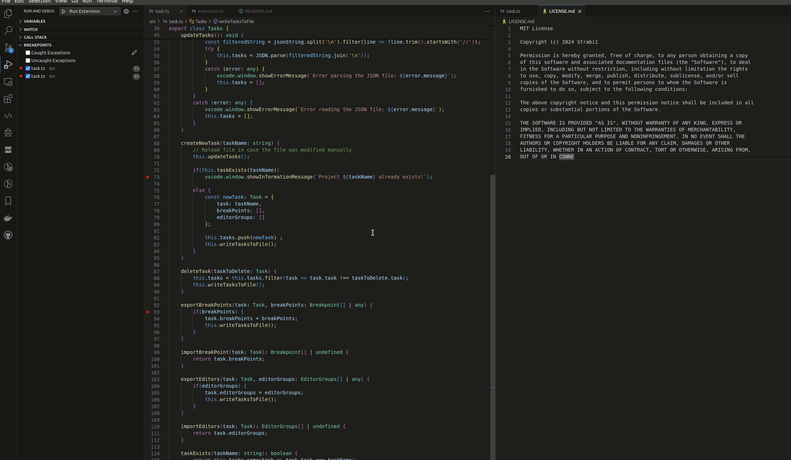

# Task Switcher

## Features

It allows you to save the breakpoints belonging to different tasks to a JSON file, and then load the breakpoints belonging to another task from the given JSON file.

Contains the
- Create New Task
- Delete Task
- Import Breakpoints
- Export Breakpoints
- Import Editors
- Export Editors

commands

## Create Task and export editors and breakpoints

## Delete Task and import editors and breakpoints

